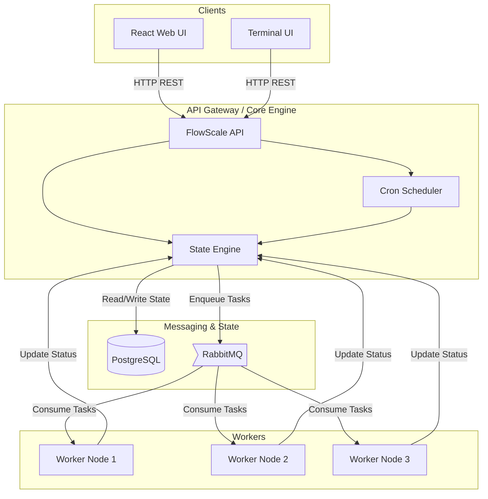

# Architecture & Design

FlowScale is designed around a decoupled, distributed architecture capable of horizontal scaling and high availability.

## High-Level Architecture Diagram

## Components

### 1. The Core Engine
The central orchestrator of FlowScale. 
- It maintains the source of truth for all workflows in PostgreSQL.
- It determines what activities need to execute next based on the workflow definition.
- It enqueues activities into RabbitMQ for workers to pick up.

### 2. The API Server
A RESTful layer exposed on top of the Engine, allowing external clients (Web, TUI) to trigger executions, inspect state, manipulate Dead Letter Queues, and configure Schedules.

### 3. The Workers
Lightweight, horizontally scalable processes that actually perform the work (activities).
- Workers bind to specific activity queues in RabbitMQ.
- They poll for tasks, execute the registered Go functions (`ActivityFunc`), and return success/failure signals to the Engine.
- You can spin up thousands of workers across multiple machines to process heavy loads concurrently.

### 4. Scheduler
A background cron daemon that evaluates registered schedules (e.g. `*/5 * * * *`) and triggers executions in the Engine automatically.

## Data Flow (A single execution)

1. **Trigger**: A user clicks "Start" in the UI. The API receives a request to start a Workflow.
2. **State Creation**: The Engine creates an execution record in PostgreSQL marked as `RUNNING`.
3. **Dispatch**: The Engine determines the first Activity and pushes a message to RabbitMQ on that activity's specific queue.
4. **Consumption**: An idle Worker subscribed to that queue pulls the message.
5. **Processing**: The Worker runs the Go function associated with that activity.
6. **Completion**: The Worker POSTs a success payload back to the Engine.
7. **Continuation**: The Engine records the success in PostgreSQL and evaluates if there is a next activity. If yes, it dispatches it. If no, the workflow is marked `COMPLETED`.
